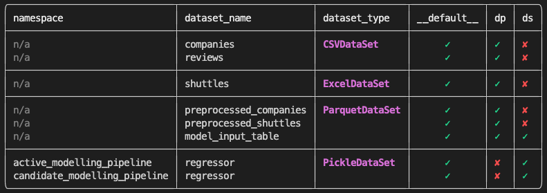

# kedro-rich

## Make your Kedro snazzy

This is a very early work in progress Kedro plugin that utilises the awesome rich library.


The intention with this piece of work is to battle test the idea, iron out the creases potentially to integrate this as a 1st class plugin hosted at kedro-org/plugins or if we're lucky, native functionality within Kedro itself.

I'm very much looking for help developing/testing this project so if you want to get involved please get in touch.

## Current Functionality

### Overridden `kedro run` command

- Does exactly the same as a regular Kedro run but kicks the progress bars into account.
- The load/save progress tasks focus purely on persisted data and ignore ephemeral `MemoryDataSets`.

https://user-images.githubusercontent.com/35801847/156947226-4d63663f-bdd4-4e36-af7c-af2eed34e2b1.mp4

- The progress bars are currently disabuled when using `ParallelRunner` since `MultiProcessing` is causing issues between `kedro` and `rich`. Further investigation if some sort of `Lock()` mechanism will allow for this to work.


### Logging via `rich.logging.RichHandler`

- This plugin changes the default `stdout` console logging handler in place of the class provided by `rich` .
- This is actually required to make the progress bars work without being broken onto new lines every time a new log message appears.
- At this point we also enable the [rich traceback handler](https://rich.readthedocs.io/en/stable/traceback.html).
- In order enable this purely plug-in side (i.e. not making the user change `logging.yml`) I've had to do an ugly bit of monkey patching. Keen to come up with a better solution here.

### Kedro `list-datasets` commands

This in time could replace the `kedro catalog list` command with something easier to parse both by humans and machines.

The `kedro list-datasets` command will produce a table view of datasets and their associated pipelines:



Adding the `--to-json` flag will print out a JSON view of the catalog that can be visually inspected by humans and machines alike:


## Install the plug-in

### (Option 1) Cloning the repository

The plug-in is in very early days so it will be a while before (if) this makes it to pypi

1. Clone the repository
2. Run `make dev-install` to install this to your environment
3. Go to any Kedro 0.17.x project and see if it works! (Please let me know if it doesn't).

### (Option 2) Direct from GitHub

1. Run `pip install git+https://github.com/datajoely/kedro-rich` to install this to your environment.
2. Go to any Kedro 0.17.x project and see if it works! (Please let me know if it doesn't).

## Run end to end example

Running `make test-project` then `make-test-run` will...

- Install the `kedro-rich` package into the environment
- Pull the 'spaceflights' `kedro-starter`
- Install requirements
- Execute `kedro run`

---------------------

## Potential future ideas

### `kedro jupyter` and  `kedro ipython`

- We could change the current init process that as well as making the `catalog`, `session` and other objects available to the user we could also overload the `print` statement.
- That way the user gets [pretty notebooks](https://www.willmcgugan.com/blog/tech/post/rich-adds-support-for-jupyter-notebooks/) for free!]

    ```python
    from rich.jupyter import print
    ```
